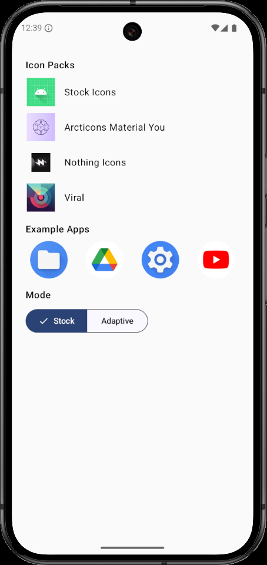
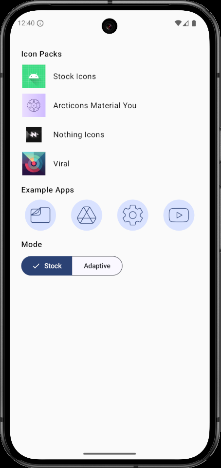
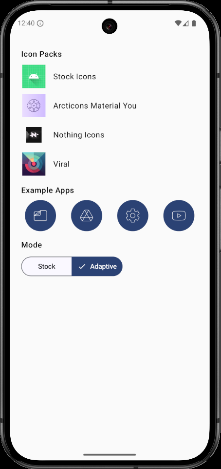

<div align="center">


# Droid Icons 

</div>

### About
This library is able to fetch icons from Icon Packs. It was made because i needed a way to get icons on claw launcher.

<div align="center">
         
         
         
</div>

### Features
This supports getting the normal icon and the adaptive version of it. 
The only thing required is the app package name and if you want to use a themed icon from an icon pack you also need it's package name.
It also support getting a list of Icon Packs in your device.

### Usage
You must first create an Icon Fetcher object:
```kotlin
val iconFetcher = IconFetcher(context)
```

To get the list of possible icon packs:
```kotlin
val iconPacks: List<IconPack> = iconFetcher.getIconPacks()
```

> Each icon pack has a name, package name and an icon.

To get the stock icon of an app:
```kotlin
val stockIcon: Icon = iconFetcher.getStockIcon(packageName)
```
> An icon contains the default drawable and a possibly null adaptive object that might have a possibly null background and foreground.

To get a themed icon from an icon pack:
```kotlin
val themedIcon: Icon? = iconFetcher.getThemedIcon(iconPack,packageName)
```
> It will return null if some error happened or the icon pack doesn't have the icon for the app.

### Permissions
The library requires the app to have Query All Packages permission but it might not be needed since it's already in it's manifest.

```xml
<uses-permission
        android:name="android.permission.QUERY_ALL_PACKAGES"
        tools:ignore="QueryAllPackagesPermission" />
```

### Install
Add jitpack url in settings.gradle.kts
```gradle
dependencyResolutionManagement {
  repositoriesMode.set(RepositoriesMode.FAIL_ON_PROJECT_REPOS)
  repositories {
        maven {
            setUrl("https://jitpack.io")
        }
  }
}
```

Add the library as dependency
```gradle
implementation ("com.github.Whiskers-Apps:droid-icons:0.1.0")
```
